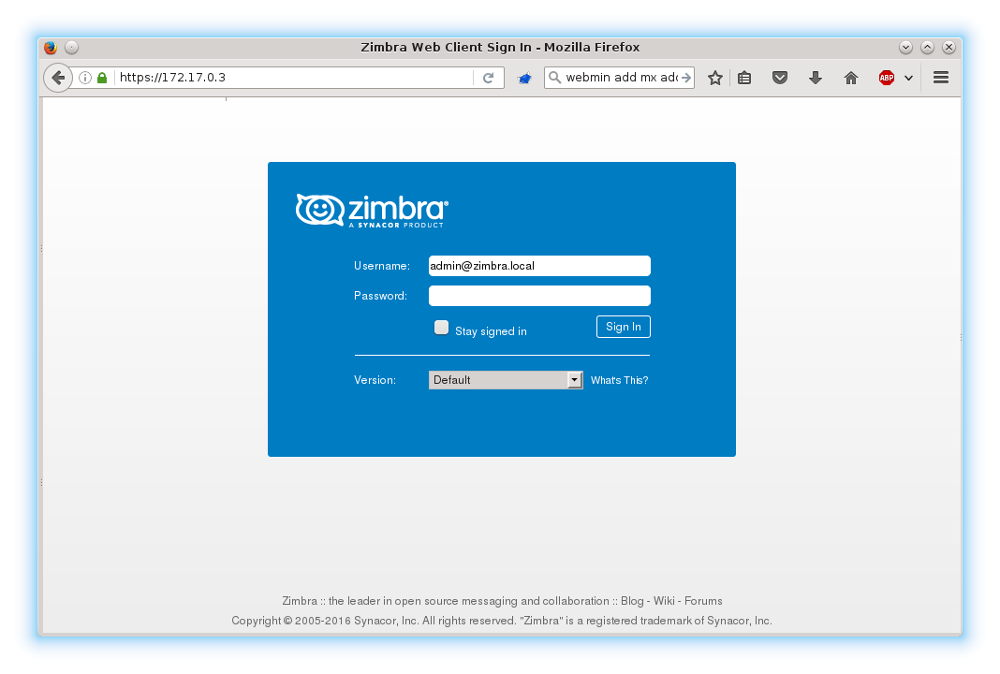
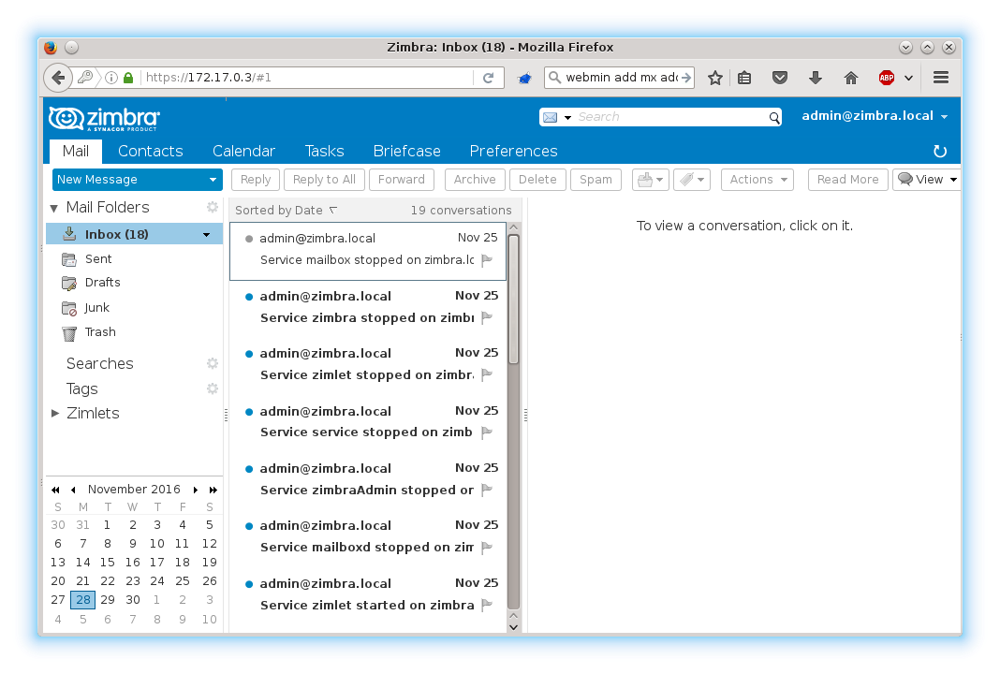
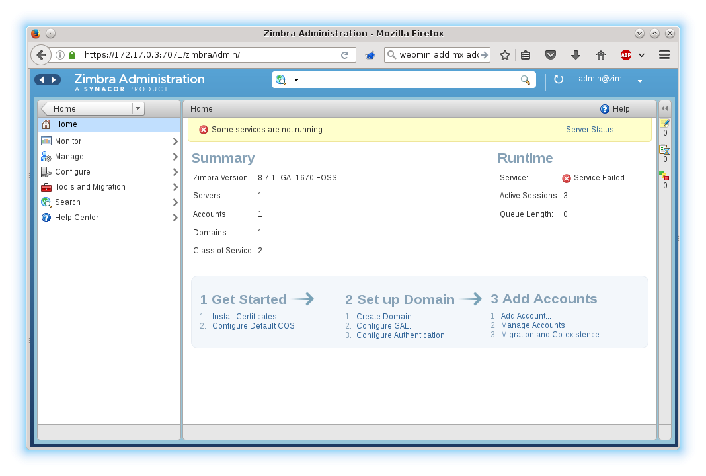

# Zimbra Docker Container

# Description

This is an attempt to deploy Zimbra open source edition as a Docker container.
It tries to package the Zimbra server as a Docker image with all needed
dependencies and really do be deployed.

# Current State

The current state is that the Zimbra server docker image is created and
can be deployed manually as a docker container. The step to deploy are currently:

0. Setup A and MX entries for the Zimbra domain.

For testing purposes, a Bind server with Webmin interface can be started.
The Zimbra domain needs to be configured to have an A and a MX record.

* Start bind container with Webmin interface.

```
make bind-start
```

* Example bind zone for Zimbra. The Zimbra domain will be `zimbra.local` with a mail domain `mx1.local`.

```
$ttl 38400
local.  IN      SOA     ns1.local. admin.local. (
                        1480066280
                        30M
                        3600
                        30M
                        38400 )
local.  IN      NS      ns1.local.
local.  IN      A       172.17.0.4
ns1.local.      IN      A       172.17.0.3
zimbra.local.   IN      CNAME   local.
local.  IN      MX      10 mx1.local.
mx1.local.      IN      A       172.17.0.4
```

1. Install Zimbra in the container on the host.

```
make zimbra-data zimbra-setup
```

2. Start Zimbra on the host.

```
make zimbra
```

## Issues

* If trying on a test machine with the bind container, the IP addresses can
be mixed up.

* Server status is red for all services, but the services are running;

```
zimbra@zimbra:~$ zmcontrol status
Host zimbra.local
        amavis                  Running
        antispam                Running
        antivirus               Running
        dnscache                Running
        ldap                    Running
        logger                  Running
        mailbox                 Running
        memcached               Running
        mta                     Running
        opendkim                Running
        proxy                   Running
        service webapp          Running
        snmp                    Running
        spell                   Running
        stats                   Running
        zimbra webapp           Running
        zimbraAdmin webapp      Running
        zimlet webapp           Running
        zmconfigd               Running
```

* Need to mount `/var` and `/etc` because the Zimbra setup modifies files in
those directories that need to be preserved.

```
docker diff zimbra
C /etc
A /etc/aliases.lmdb
C /etc/logrotate.d
C /etc/logrotate.d/zimbra
C /etc/rsyslog.d
C /etc/rsyslog.d/50-default.conf
A /etc/rsyslog.d/60-zimbra.conf
C /root
A /root/.bash_history
C /run
C /run/resolvconf
C /run/resolvconf/interface
A /run/resolvconf/interface/lo.zimbra-unbound
A /run/resolvconf/resolv.conf
A /run/rsyslogd.pid
A /run/sendsigs.omit.d
A /run/sendsigs.omit.d/rsyslog
A /run/sshd
C /tmp
A /tmp/.UUID_NODEID
A /tmp/.UUID_STATE
A /tmp/.java_pid17962
A /tmp/crontab.zimbra
A /tmp/crontab.zimbra.orig
A /tmp/crontab.zimbra.proc
A /tmp/hsperfdata_root
A /tmp/hsperfdata_root/17962
A /tmp/hsperfdata_zimbra
A /tmp/hsperfdata_zimbra/11971
A /tmp/hsperfdata_zimbra/18606
A /tmp/zmsetup.20161129-093343.log
A /tmp/zmsetup.log
C /var
C /var/log
A /var/log/auth.log
A /var/log/kern.log
A /var/log/mail.err
A /var/log/mail.log
A /var/log/syslog
A /var/log/zimbra-stats.log
C /var/log/zimbra.log
C /var/spool
C /var/spool/cron
C /var/spool/cron/crontabs
A /var/spool/cron/crontabs/zimbra
```

## Demo







# Contributions

The idea for the image was taken from the [zimbra-docker](https://github.com/Zimbra-Community/zimbra-docker) Git repository.

# License

*The MIT License (MIT)*

Copyright (c) 2016 Erwin Müller, <erwin.mueller@nttdata.com>

Permission is hereby granted, free of charge, to any person obtaining a copy
of this software and associated documentation files (the "Software"), to deal
in the Software without restriction, including without limitation the rights
to use, copy, modify, merge, publish, distribute, sublicense, and/or sell
copies of the Software, and to permit persons to whom the Software is
furnished to do so, subject to the following conditions:

The above copyright notice and this permission notice shall be included in all
copies or substantial portions of the Software.

THE SOFTWARE IS PROVIDED "AS IS", WITHOUT WARRANTY OF ANY KIND, EXPRESS OR
IMPLIED, INCLUDING BUT NOT LIMITED TO THE WARRANTIES OF MERCHANTABILITY,
FITNESS FOR A PARTICULAR PURPOSE AND NONINFRINGEMENT. IN NO EVENT SHALL THE
AUTHORS OR COPYRIGHT HOLDERS BE LIABLE FOR ANY CLAIM, DAMAGES OR OTHER
LIABILITY, WHETHER IN AN ACTION OF CONTRACT, TORT OR OTHERWISE, ARISING FROM,
OUT OF OR IN CONNECTION WITH THE SOFTWARE OR THE USE OR OTHER DEALINGS IN THE
SOFTWARE.
